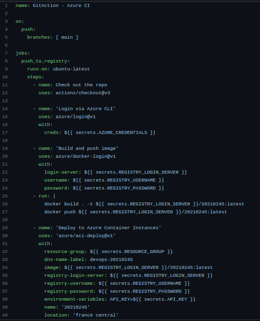
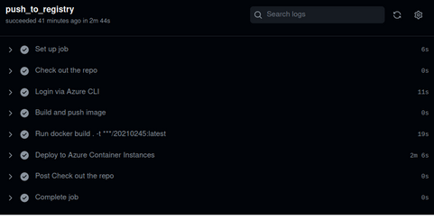
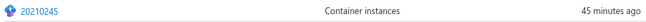
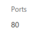
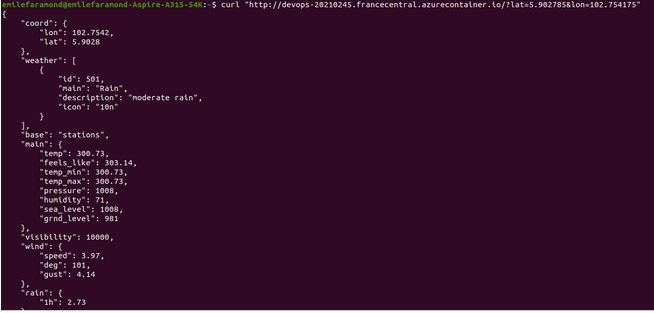

# TP3 :smile:
## FARAMOND Emile

  

#### I) Consignes :

> Deployer sur Azure Container Instance (ACI) using Github Actions

> Mettre à disposition son image (format API) sur Azure Container Registry (ACR) using Github Actions

> Mettre à disposition son code dans un repository Github

  
> Lien aide : [https://docs.microsoft.com/en-us/azure/container-instances/container-instances-github-action](https://docs.microsoft.com/en-us/azure/container-instances/container-instances-github-action)

  

#### II) Etapes et mode d’emploi pour réaliser le TP :

1.  Rejoindre le github : efrei-devops-apprentis-bdml
    
2.  Se connecter au groupe de ressources devops-tp3 (sur Azure)
    
3.  Créer une github action (Actions> New WorkFlow > main.yml  :
\
    

On spécifie  :

> la localisation : 
```bash 
location: 'france central'
```

> le dns : dns-name-label:
```bash
devops-20210245 (avec notre numero etudiant efrei)
```

> l’Azure Container Registry : 
```bash
efreidevops.azurecr.io
```

> l'ACI name : id efrei

> l'ACR repository name : id efrei


Remarque : Il faut ajouter dans les settings de sécurités sur github notre clé API openwheather puis on la récupere ici dans le main.yml avec : 
``` php
API_KEY=${{ secrets.API_KEY }}
```


4) Dans le  fichier de construction de application main.py , on specifie l'host et le port: 
```php
if __name__ == '__main__':
app.run(host = "0.0.0.0", debug=True,port=80)
```
> ATTENTION : Par défault, chez Azure le port est 80.

  

5)Ensuite, dans le fichier Dockerfile, on expose le port 80 
```php
EXPOSE 80
```
  
6) On verifie que le job soit bien crée :
\
 

7) Sur azure, modifier “Default subscription filter” pour accepter “EFREI Apprentis-BDML”. Ensuite vérifier que le container ait bien était crée :
\
 

puis qu’il expose sur le port 80  (dans les propriétés du conteneur) :
\
 

8) Enfin, tester le curl avec la ligne de commande :
```bash
curl "http://devops-20210245.francecentral.azurecontainer.io/?lat=5.902785&lon=102.754175"
```
On obtient le resultat : 
\
 
